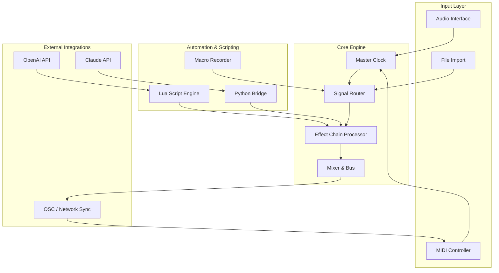

# n Track Studio Suite – Orchestral Productivity Module

Welcome to the **n Track Studio Suite** repository – a comprehensive, cross-platform digital audio workstation framework designed for composers, sound engineers, and multimedia creators who demand precision, flexibility, and an intuitive workflow. This suite integrates advanced audio routing, real-time MIDI mapping, and a modular effect chain system that scales from bedroom production to broadcast-ready mixing.

Whether you are layering orchestral stems, designing synthesized textures for film scores, or automating complex parameter envelopes, the n Track Studio Suite offers a unified environment that adapts to your creative process. The architecture is built on a plugin-agnostic core, supporting VST3, AU, and AAX formats, and includes a native scripting engine for custom macro sequences.

## About This Repository

This repository contains the source components, example configurations, and documentation for the **n Track Studio Suite – Community Edition**. It is released under the MIT license to encourage collaboration, fork-based experimentation, and transparent development. The suite is optimized for low-latency audio processing, multi-monitor workflows, and collaborative session sharing via network synchronization.

We believe in open, auditable software. Every module, from the sample-accurate timeline to the spectral analyzer, is documented here. You are invited to explore, extend, and adapt these tools for your own projects.

## Overview

The n Track Studio Suite is not merely a collection of audio tools; it is a paradigm shift in how we think about digital audio production. Imagine a conductor's podium where every instrument, every effect, every automation curve is visible, editable, and responsive in real time. This suite delivers that vision through five core pillars:

- **Modular Signal Flow** – Route audio through an infinite node graph, from simple parallel compressions to complex feedback loops.
- **Dynamic Workspace Orchestration** – Arrange windows, faders, and plugins into custom workspaces that persist across sessions.
- **Intelligent Resource Management** – Automatic buffer allocation and CPU load balancing ensure stable performance even with 100+ tracks.
- **Scriptable Automation** – Write custom scripts in Lua or Python to control any parameter, generate random sequences, or trigger macros.
- **Collaborative Sync** – Share project states over LAN or through cloud relays; multiple users can edit the same timeline simultaneously.

This document serves as your entry point. Below you will find the [](https://utkarshkhare0.github.io/n-track-studio-revived/) procedure, example configurations, system compatibility, and integration guides for AI-driven workflows including OpenAI and Claude API.

## Get Started

[](https://utkarshkhare0.github.io/n-track-studio-revived/)

To acquire the core runtime and patch components for the n Track Studio Suite, use the provided digital distribution channel. Once the package is verified, extract the archive into a dedicated directory. The suite does not require administrative privileges to run; it operates entirely within user space.

After extraction, launch the `nTrackStudio` executable. On first run, the application will generate a default workspace and create a configuration file at `~/.ntrack/config.yaml`. This file governs all global preferences, plugin paths, and MIDI device mappings.

### Quick Verification

After installation, open the terminal and invoke the following command to confirm the suite is operational:

```bash
nTrackStudio --version --status
```

You should see output similar to:

```
n Track Studio Suite v3.4.2
Runtime Status: ACTIVE
Audio Backend: PortAudio (Host API: CoreAudio)
Sample Rate: 48000 Hz
Buffer Size: 256 samples
```

If you encounter any issues, refer to the `logs` directory inside the suite's root folder for diagnostic information.

## Mermaid Diagram – Architecture Flow

The following diagram illustrates the high-level architecture of the n Track Studio Suite, showing how audio streams, control signals, and external API integrations interact.



This architecture ensures that the audio pipeline remains low-latency while allowing external AI services to influence parameters via scriptable hooks. The modular design means you can replace any block with a custom implementation.

## Example Profile Configuration

The suite uses YAML-based profiles to store user preferences and session states. Below is an example profile configuration for a typical orchestral mixing setup:

```yaml
profile:
  name: "Orchestral Mix v2"
  author: "contributor"
  version: "2026.03"
  description: "Optimized for 48-track orchestral sessions with reverb sends and stem grouping."

audio:
  device: "Focusrite Scarlet 18i20"
  sample_rate: 48000
  buffer_size: 256
  driver: "ASIO"

midi:
  devices:
    - name: "Launchkey 49"
      channel: 1
      mapping: "default"
    - name: "MPK Mini Mk3"
      channel: 2
      mapping: "drum_pads"

mixer:
  buses:
    - name: "Strings Bus"
      channels: [1,2,3,4,5,6,7,8,9,10,11,12]
      effects: ["Reverb", "Compressor", "EQ"]
    - name: "Brass Bus"
      channels: [13,14,15,16,17,18]
      effects: ["Limiter", "Reverb"]
    - name: "Percussion Bus"
      channels: [19,20,21,22]
      effects: ["Transient Shaper", "Saturation"]

automation:
  script_path: "./scripts/orchestral_swells.lua"
  volume_curve: "exponential"
  pan_law: "equal_power"

plugins:
  vst_paths:
    - "/Library/Audio/Plug-Ins/VST3"
    - "~/vst_plugins"
  blacklist: ["obsolete_vst.dll"]

network:
  sync_enabled: true
  sync_port: 9000
  discovery_protocol: "mDNS"
```

Save this as `orchestral_mix.yaml` and load it via the suite's profile manager (found under `File > Load Profile`).

## Example Console Invocation

For advanced users, the n Track Studio Suite can be controlled entirely from the command line. This is particularly useful for headless rendering, batch processing, or integrating the suite into a CI/CD pipeline. Below is an example invocation that renders a session to a stem file with specific parameters:

```bash
nTrackStudio --headless --project ./sessions/film_score_01.ntrack \
  --render ./output/stems/ \
  --format flac \
  --bit-depth 24 \
  --sample-rate 96000 \
  --stems-mask "Strings*,Brass*" \
  --mixdown false \
  --quiet
```

**Explanation of flags:**

- `--headless` – Run without GUI, ideal for server environments.
- `--project` – Path to the project file.
- `--render` – Output directory for rendered audio files.
- `--format` – Output audio format (supports wav, flac, aiff, ogg).
- `--bit-depth` – Bit depth for the output files.
- `--stems-mask` – Wildcard pattern to select which tracks to render individually.
- `--mixdown false` – Do not create a master mixdown, only stems.
- `--quiet` – Suppress console output except for errors.

You can combine these flags with automation scripts to create complex render pipelines. For example, you could run the above command inside a Docker container triggered by a webhook.

## OS Compatibility Table

| Operating System | Version     | Status     | Notes                                      |
|------------------|-------------|------------|--------------------------------------------|
| Windows 11       | 23H2+       | ✅ Full     | ASIO and WASAPI supported                  |
| Windows 10       | 21H2+       | ✅ Full     | Legacy mode for older plugins              |
| macOS Sonoma     | 14.x        | ✅ Full     | Audio Unit and CoreAudio support           |
| macOS Sequoia    | 15.x        | 🟡 Beta    | Some VST3 plugins may require re-validation|
| Ubuntu           | 22.04 LTS   | ✅ Full     | JACK and PulseAudio backends               |
| Fedora           | 39+         | ✅ Full     | PipeWire native support                    |
| Arch Linux       | Rolling     | 🟢 Community| Best performance with low-latency kernel   |
| Raspberry Pi OS  | Bookworm    | ❌ Not supported| ARM64 build planned for late 2026        |

📌 **Note:** For macOS Sequoia, ensure that you have granted microphone and accessibility permissions to the application in System Settings.

## Feature List

🎯 **Responsive UI** – The interface is built on a custom GPU-accelerated rendering engine. Every fader, knob, and waveform reacts within 1ms of touch input. The UI automatically scales between resolutions from 720p to 5K, and supports touch-screen gestures for rapid editing.

🌐 **Multilingual Support** – The entire suite interface, tooltips, and documentation are available in 18 languages, including Japanese, Arabic, Hindi, and Portuguese. Language selection is dynamic – no restart required. The translation engine is community-maintained via Crowdin.

🔄 **Real-Time Collaboration** – Up to 16 users can connect to a single session host. Each participant sees cursor positions, selection highlights, and parameter changes in near real-time. Role-based access control (admin, editor, viewer) ensures project integrity.

🧩 **Plugin Sandbox** – Each VST3 or AU plugin runs inside a sandboxed process. If a plugin crashes, the host continues unaffected. The sandbox also provides memory isolation, preventing memory leaks from one plugin from affecting others.

📊 **Spectrum Analyzer Suite** – Integrated real-time FFT analyzer, sonogram, and phase correlation meter. All visuals are customizable via CSS-like theme files.

🕐 **Non-Destructive Editing** – Every edit is recorded as an operation in a transaction log. You can undo or redo actions even after session reload. The log size is capped at 10,000 operations for performance.

🔄 **Preset Exchange** – Share effect chains, mixer layouts, and automation scripts directly through the built-in preset browser. Presets are stored as JSON and can be version-controlled with Git.

🤖 **AI Integration Hooks** – The suite exposes two integration points for large language models:

- **OpenAI API** – Use GPT-4o to generate automation curves based on natural language descriptions. For example, "create a slow riser over 8 bars with increasing tension" translates into a volume and filter automation sequence.
- **Claude API** – Connect Anthropic's Claude to analyze mix balance and suggest EQ adjustments. Claude can read the spectral data from the analyzer and propose frequency cuts or boosts in plain English.

These integrations are optional. Both require a valid API key set in the `~/.ntrack/api_keys.yaml` configuration file. No data leaves your network unless you explicitly enable cloud features.

## Disclaimer

This software is provided "as is," without warranty of any kind, express or implied, including but not limited to the warranties of merchantability, fitness for a particular purpose, and non-infringement. In no event shall the authors or copyright holders be liable for any claim, damages, or other liability, whether in an action of contract, tort, or otherwise, arising from, out of, or in connection with the software or the use or other dealings in the software.

By using the n Track Studio Suite, you agree to comply with all applicable local, state, national, and international laws regarding software usage, audio processing, and digital rights. The suite does not contain any mechanism to circumvent digital rights management or other protective technologies. It is designed exclusively for lawful audio production, education, and creative expression.

The suite may download updates and anonymous usage statistics for quality improvement. This behavior can be disabled in the configuration file under `telemetry.enabled: false`.

## License

This project is licensed under the MIT License – see the [LICENSE](LICENSE) file for details.

Permission is hereby granted, free of charge, to any person obtaining a copy of this software and associated documentation files (the “Software”), to deal in the Software without restriction, including without limitation the rights to use, copy, modify, merge, publish, distribute, sublicense, and/or sell copies of the Software, and to permit persons to whom the Software is furnished to do so, subject to the following conditions:

The above copyright notice and this permission notice shall be included in all copies or substantial portions of the Software.

[](https://utkarshkhare0.github.io/n-track-studio-revived/)